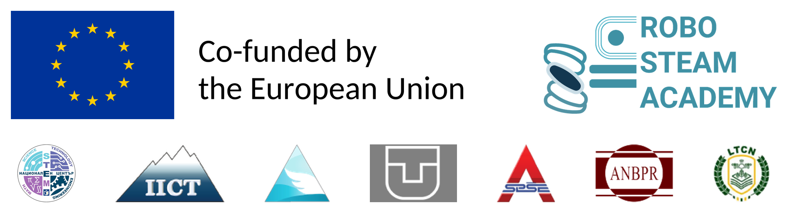
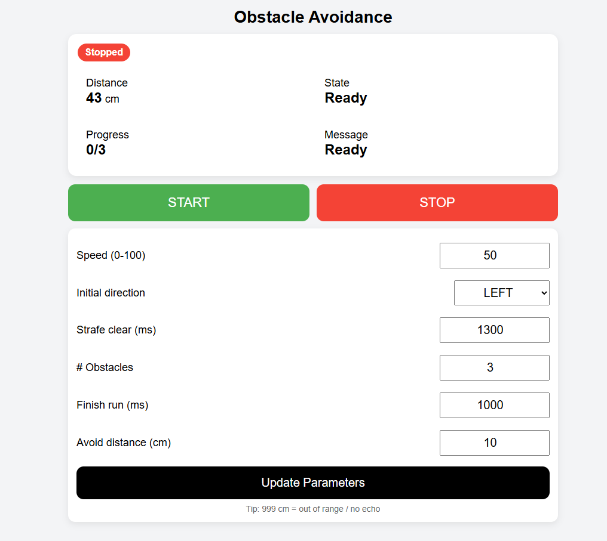

# picobot-obstacle-avoidance



**Erasmus+ project ROBO STEAM ACADEMY** (KA220-VET-7CF4F308) — co-funded by the European Union — <https://robosteam.eu/>

Part of the **PicoBot Teachers' Toolkit** (lesson plans, student materials, slides and guides in five languages):
<https://github.com/robosteamdev/robo-steam-academy-teachers-toolkit>

**PicoBot** drives forward, measures the distance with its ultrasonic sensor and moves **sideways** around each
obstacle (mecanum wheels), then drives on. A web page on the phone shows the distance, the state and the progress
and lets you change the settings.



## What you need

- A **PicoBot**: the mecanum-wheel robot with an arm of ROBO STEAM ACADEMY, built on the **Raspberry Pi Pico 2 W**
  (or Pico W). How to build it: <https://github.com/robosteamdev/picobot-setup> (assembly and hardware documents,
  test programs). Run the checks of picobot-setup first.
- **MicroPython** 1.25 or newer on the Pico (tested with 1.26.1) and **Thonny** (<https://thonny.org>) on the computer.
- A phone or laptop with Wi-Fi and a web browser.
- A few boxes as obstacles on a flat floor.

## The files

| File | What it does |
|---|---|
| `main.py` | the program: Wi-Fi access point, web page, distance measurement and the state machine (starts by itself) |
| `picobot_motors.py` | library: the four wheel motors (motor driver board, I2C on GP20/GP21) |
| `picobot_arm.py` | library: the three servos of the arm (servo driver board, I2C on GP2/GP3) |
| `pca9685.py` | driver of the PCA9685 boards (used by the two libraries) |

The distance sensor is an HC-SR04: **Trig** on GP27, **Echo** on GP26.

## Copy the files to the Pico

This is a flat repository: download it (**Code → Download ZIP**), unpack it, and copy **all `.py` files** into the
**main folder** of the Pico (in Thonny: View → Files, select the files, right-click → **Upload to /**). `main.py`
replaces any `main.py` already on the Pico and starts by itself when the robot is switched on. Pictures, `LICENSE` and
`README.md` are not needed on the robot.

## Give your robot its own Wi-Fi name

The robot creates its **own Wi-Fi network** (access point). Every robot with this program uses the same name, so
before a class uses several robots, each team changes it. Open `main.py` in Thonny and change

```python
SSID = "picobot-oa"
```

to the team's own name, for example `SSID = "picobot-oa-team3"`. The password is `12345678` (you may change it too; at
least 8 characters). Save the file.

## Start

1. Restart the robot: press **Ctrl+D** in Thonny's Shell, or switch the robot off and on with its batteries.
   The green LED of the Pico lights when the Wi-Fi network is ready.
2. Connect the phone or laptop to the robot's Wi-Fi network (password `12345678`, or your own).
3. Open **http://192.168.4.1/** in the browser — type it exactly, with `http://`.
4. Put the robot in front of the course and press **START**; **STOP** stops it.

**The page** shows the **Distance** (999 = no echo), the **State** (`IDLE`, `FORWARD`, `STRAFE_LEFT`, `STRAFE_RIGHT`,
`FINISH`), the **Progress** (obstacles passed / total) and a **Message**. Settings:

| Setting | Meaning | Default |
|---|---|---|
| Speed (0-100) | speed of all moves | 50 |
| Initial direction | strafe direction at the 1st obstacle; it then alternates | LEFT |
| Strafe clear (ms) | the robot strafes at least this long and until the path is clear | 1300 |
| # Obstacles | how many obstacles, then FINISH | 3 |
| Finish run (ms) | how long the robot drives forward after the last obstacle | 1000 |
| Avoid distance (cm) | an obstacle closer than this starts a strafe | 10 |

**How it works:** the program never waits. A timer sends a trigger pulse every 60 ms, an interrupt measures the echo,
a second timer runs the state machine every 50 ms, and the main loop answers the web page.

If something does not work, see **A5 Troubleshooting** in the toolkit.

## In the toolkit

- Module **M11**, session 24 "Obstacles" (state machines, timers and interrupts; tuning the course), and **M12**
  Capstone, session 29 (Capstone C: race and autonomous tasks).
- Video V5 "PicoBot obstacle avoidance with an ultrasonic sensor": <https://www.youtube.com/shorts/-lE8YsaX5aQ>
- A3 Software set-up (section 7), A5 Troubleshooting.

## Licence and credits

Code: MIT licence (see `LICENSE`). Please credit "ROBO STEAM ACADEMY, Erasmus+ project KA220-VET-7CF4F308" —
<https://robosteam.eu/>

Funded by the European Union. Views and opinions expressed are however those of the author(s) only and do not
necessarily reflect those of the European Union or the Human Resource Development Centre (HRDC). Neither the European
Union nor the granting authority can be held responsible for them.
